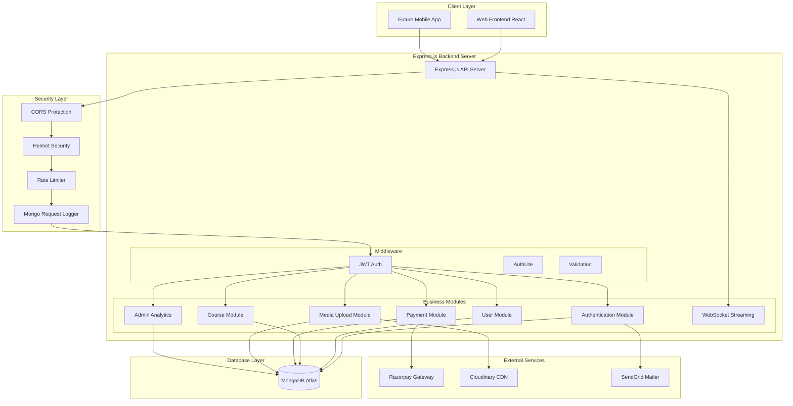
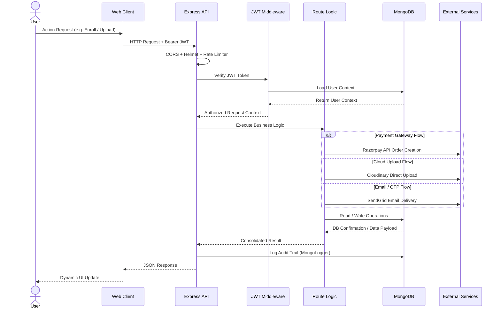
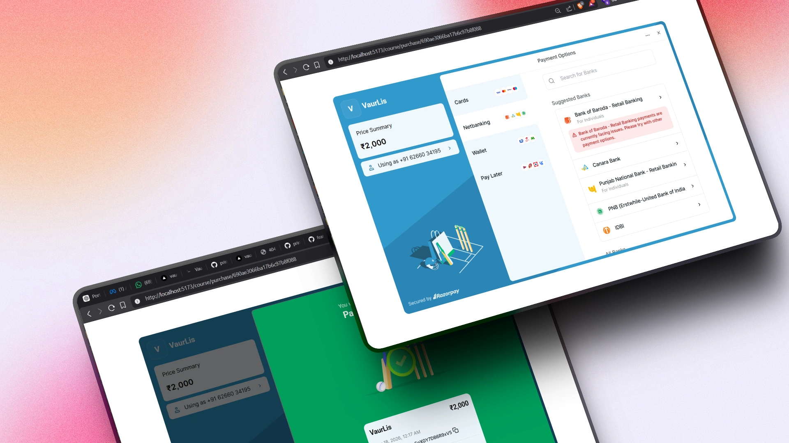
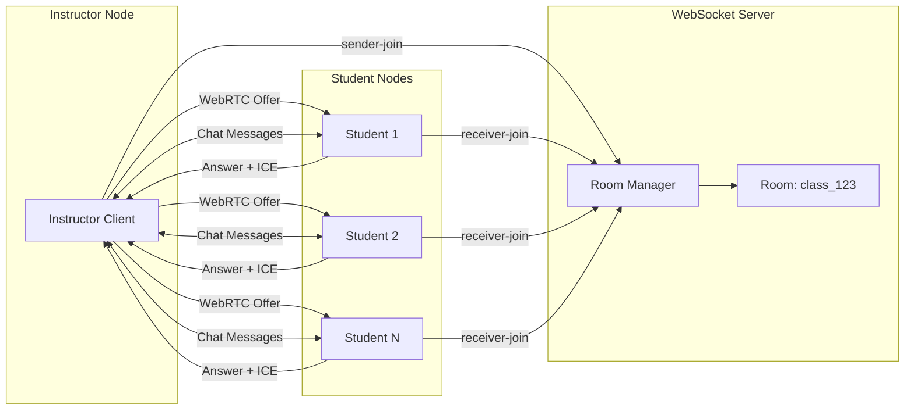
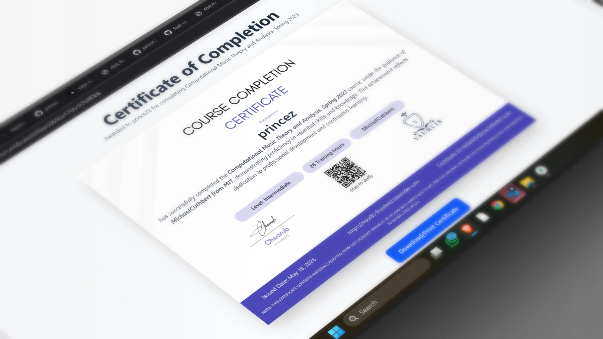
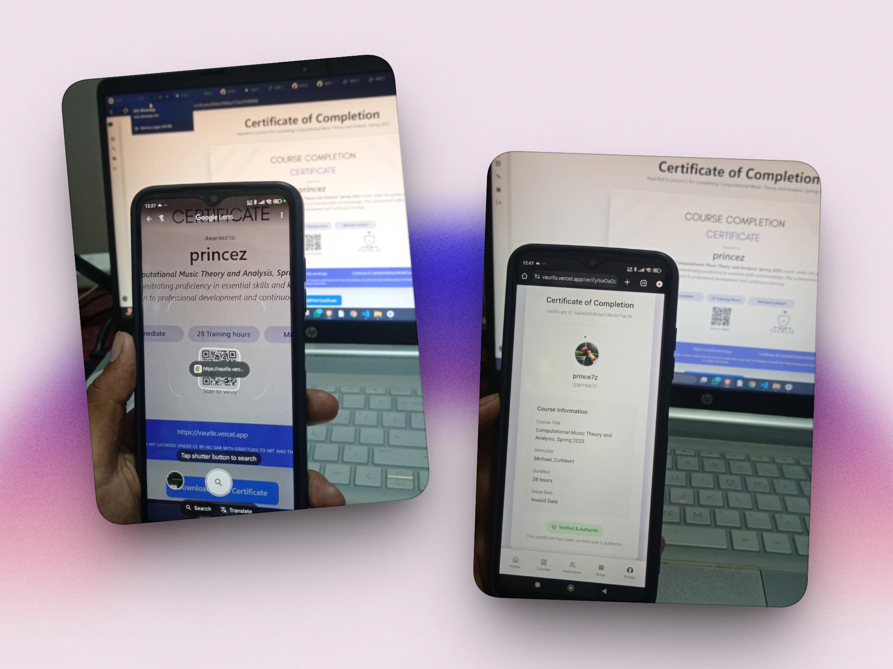
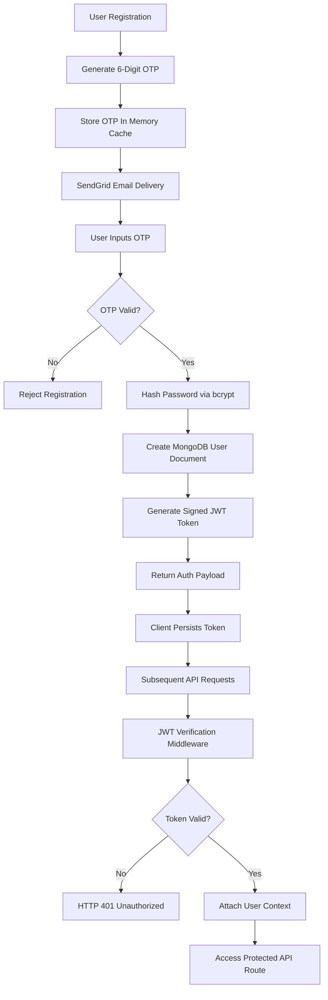
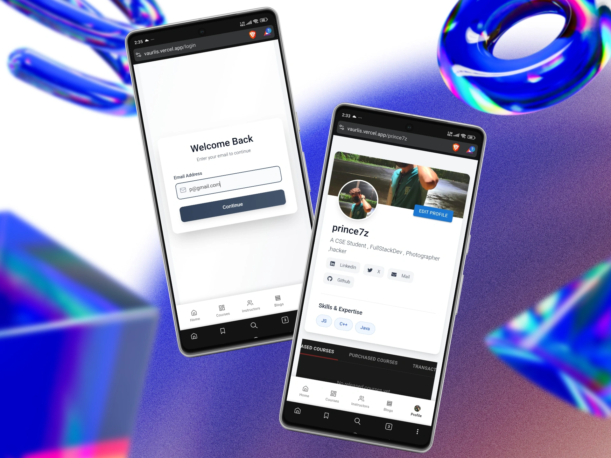
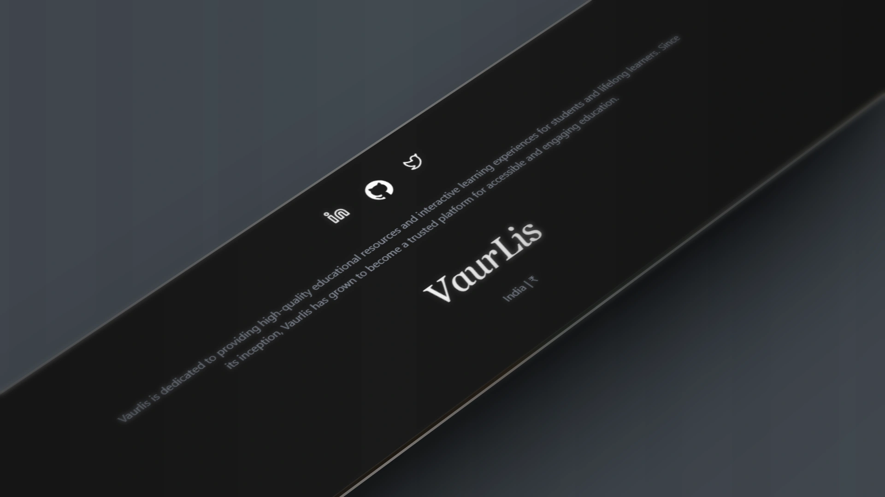

<div align="center">

# VaurLis Educations
### *Next-Generation Learning Management System & Interactive Platform*

[](https://github.com/prince7z/Coursera)
[](LICENSE)
[](https://nodejs.org/)
[](https://reactjs.org/)
[](https://www.typescriptlang.org/)
[](https://tailwindcss.com/)

<br>

<p align="center">
  
</p>

*Empowering educators and learners through real-time streaming, automated certification, and seamless monetization.*

</div>

---

## Executive Overview

**VaurLis Educations** is a production-ready, full-stack Learning Management System (LMS) designed to bridge the gap between students, independent instructors, and educational institutions. Built with modern web technologies, VaurLis offers an end-to-end learning lifecycle—from course creation and live streaming to secure payment processing and tamper-proof digital certification.

### Mission & Value Proposition
Our mission is to democratize modern education. Whether you are an expert sharing specialized skills or a student pursuing career advancement, VaurLis provides the tools to teach, learn, and succeed.

| For Instructors | For Students | For Institutions |
| :--- | :--- | :--- |
| **Monetize Knowledge**: Flexible pricing with instant Razorpay payouts | **Interactive Learning**: HD video streaming & interactive live classes | **Scalable Infrastructure**: Micro-services ready backend topology |
| **Comprehensive Analytics**: Track revenue, student engagement & reviews | **Verified Credentials**: Blockchain-ready certificates with QR validation | **Custom Branding**: Tailored navigation headers, footers & certificates |
| **Course Authoring**: Multimedia content support (Video, PDF, Quizzes) | **Peer Network**: Learn from top featured industry leaders & creators | **Audit & Security**: Fine-grained role permissions & security logging |

---

## System Architecture & Workflow

### High-Level Architecture Topology
The platform follows a decoupled client-server architecture with multi-layered security and external service integrations.



---

### End-to-End Request Lifecycle
Every client request undergoes rigorous validation, authorization, execution, and auditing.



---

## Key Features Showcase

### 1. Course Catalog & Instructor Network
Discover courses taught by verified industry experts. Detailed instructor cards showcase ratings, student enrollments, and professional expertise.

<div align="center">
  
  <p><em>Featured Instructors & Credentials Showcase Interface</em></p>
</div>

- **Smart Filtering**: Filter by category, difficulty level, rating, or price.
- **Rich Course Player**: Seamless video playback powered by Cloudinary CDN streaming.
- **Reviews & Ratings**: Transparent feedback system to guarantee course quality.

---

### 2. Secure Payments & Instant Monetization
Integrated with **Razorpay** to support card payments, UPI, Net Banking, and digital wallets with dynamic order generation and instant enrollment verification.

<div align="center">
  
  <p><em>Seamless Razorpay Payment Checkout Experience</em></p>
</div>

- **PCI-DSS Compliant**: Payment data is handled directly by Razorpay's encrypted checkout.
- **Automated Webhooks**: Instant course activation upon successful signature verification.
- **Transaction History**: Comprehensive financial logs for both learners and instructors.

---

### 3. Real-Time WebRTC Live Streaming & Interactive Classes
Instructors can launch live interactive classes with peer-to-peer WebRTC video, low-latency WebSocket signaling, and real-time chat.



- **P2P Video Mesh**: Ultra-low latency communication for live Q&A sessions.
- **Room Management**: Dynamic creation and cleanup of streaming rooms (`Server/WSS.ts`).
- **Session Chat**: Instant messaging during live broadcasts.

---

### 4. Automated Digital Certificates & Verification Portal
Upon course completion, students receive a custom-designed digital certificate equipped with a unique QR code for instant authenticity verification.

<div align="center">
  <table width="100%">
    <tr>
      <td width="50%" align="center">
        
        <br><sub><b>Custom Digital Certificate Template</b></sub>
      </td>
      <td width="50%" align="center">
        
        <br><sub><b>QR Code Verification Portal</b></sub>
      </td>
    </tr>
  </table>
</div>

- **Tamper-Proof QR Verification**: Scanning the certificate QR code instantly opens the verification registry.
- **Downloadable PDF**: High-resolution certificate rendering for print and LinkedIn sharing.
- **Custom Institutional Branding**: Support for custom badges, signatures, and logos.

---

### 5. Robust Authentication & Security Flow
Multi-factor security workflow featuring SendGrid OTP verification, bcrypt password hashing, and stateless JWT authentication.



- **Data Protection**: Security headers enforced via `Helmet.js`.
- **Injection Prevention**: Sanitized NoSQL queries preventing MongoDB injection.
- **Rate Limiting**: Protection against brute-force login attempts.

---

### 6. Mobile First & Sleek UI Design
Designed with Tailwind CSS, VaurLis offers a responsive mobile layout alongside structured sidebar navigation and brand elements.

<div align="center">
  <table width="100%">
    <tr>
      <td width="40%" align="center">
        
        <br><sub><b>Mobile Responsive Interface</b></sub>
      </td>
      <td width="60%" align="center">
        
        <br><sub><b>Sidebar Navigation & Branding</b></sub>
        <br><br>
        
        <br><sub><b>Footer & Platform Details</b></sub>
      </td>
    </tr>
  </table>
</div>

---

## Technology Stack

<div align="center">

### Backend Architecture
[](https://nodejs.org/)
[](https://expressjs.com/)
[](https://www.typescriptlang.org/)
[](https://www.mongodb.com/)
[](https://developer.mozilla.org/en-US/docs/Web/API/WebSocket)

### Frontend Client
[](https://reactjs.org/)
[](https://www.typescriptlang.org/)
[](https://vitejs.dev/)
[](https://tailwindcss.com/)
[](https://recoiljs.org/)

### Third-Party Services
[](https://razorpay.com/)
[](https://cloudinary.com/)
[](https://sendgrid.com/)
[](https://jwt.io/)
[](https://webrtc.org/)

</div>

---

## Repository Structure

```
Coursera/
├── backend/                           # Express.js REST & WebSockets Server
│   ├── config/                        # Integrations (Cloudinary, Logger, Mailer)
│   ├── DB/                            # Mongoose Models & Schemas
│   ├── Midware/                       # Auth & Security Middlewares
│   ├── Routes/                        # API Route Modules (Admin, Course, Payment, Auth)
│   ├── utlis/                         # OTP Cache & Helper Utilities
│   ├── Server.ts                      # Main Express Application Entry Point
│   └── WSS.ts                         # WebSocket Server for Real-Time Streaming
│
├── frontend/                          # Vite + React Client
│   ├── src/
│   │   ├── Component/                 # UI Atoms, Navigation & Certificates
│   │   ├── pages/                     # Page Views (Course, LiveClass, Purchase, Certs)
│   │   ├── config/                    # Endpoint & Client Configs
│   │   ├── App.tsx                    # Core Routing & Recoil Root
│   │   └── main.tsx                   # Client Entry Point
│   ├── vite.config.ts                 # Vite Bundler Setup
│   └── tailwind.config.ts             # Styling & Utility Tokens
│
└── readme-content/                    # Visual Assets & Diagram Definitions
    ├── homepage.webp
    ├── instructors.webp
    ├── razorpayint.webp
    ├── certificatedesign.webp
    ├── scan-verify.webp
    ├── mobilescreen.webp
    ├── sidebarbranding.webp
    ├── footerbranding.webp
    └── mermaid.txt                    # Architecture & Flow Diagrams
```

---

## Quick Start & Installation

### Prerequisites
- **Node.js**: `v18.0.0` or higher
- **MongoDB**: Local MongoDB instance or Atlas connection string
- **Package Manager**: `npm` or `yarn`

### Setup Instructions

1. **Clone the Repository**
   ```bash
   git clone https://github.com/prince7z/Coursera.git
   cd Coursera
   ```

2. **Backend Configuration**
   ```bash
   # Install backend dependencies
   npm install

   # Configure Environment Variables
   cp .env.example .env
   ```
   *Edit `.env` with your Mongo URI, JWT secret, Razorpay credentials, and Cloudinary keys.*

3. **Frontend Configuration**
   ```bash
   cd frontend
   npm install
   ```

4. **Launch Development Servers**

   *Terminal 1 (Backend Server & WebSockets):*
   ```bash
   npm run dev
   ```

   *Terminal 2 (Vite Frontend):*
   ```bash
   cd frontend
   npm run dev
   ```

5. **Access Application**
   - **Frontend App**: `http://localhost:5173`
   - **API Server**: `http://localhost:5000`

---

## API Endpoint Overview

<details>
<summary><strong>Authentication & User Routes</strong></summary>

| Method | Endpoint | Description | Auth Required |
|:---|:---|:---|:---:|
| `POST` | `/api/auth/register` | User signup & OTP trigger | Public |
| `POST` | `/api/auth/verify-otp` | OTP validation & User creation | Public |
| `POST` | `/api/auth/login` | User login & JWT issue | Public |
| `GET` | `/api/user/profile` | Retrieve user profile details | Required |

</details>

<details>
<summary><strong>Course Management Routes</strong></summary>

| Method | Endpoint | Description | Auth Required |
|:---|:---|:---|:---:|
| `GET` | `/api/courses` | List all available courses | Public |
| `GET` | `/api/courses/:id` | Get specific course details | Public |
| `POST` | `/api/courses` | Create new course (Instructor/Admin) | Required |
| `PUT` | `/api/courses/:id` | Update existing course content | Required |

</details>

<details>
<summary><strong>Payment & Enrollment Routes</strong></summary>

| Method | Endpoint | Description | Auth Required |
|:---|:---|:---|:---:|
| `POST` | `/api/secure/create-order/:courseId` | Create Razorpay order | Required |
| `POST` | `/api/secure/verify-payment` | Validate payment signature | Required |
| `GET` | `/api/user/transactions` | User payment history | Required |

</details>

<details>
<summary><strong>WebRTC & Live Classes</strong></summary>

| Method | Endpoint / Protocol | Description | Auth Required |
|:---|:---|:---|:---:|
| `POST` | `/api/user/schedule/liveclass/:id` | Schedule a live session | Required |
| `GET` | `/api/user/liveclass/:id` | Fetch session metadata | Required |
| `WS` | `/ws` | WebSockets for WebRTC signaling & chat | Required |

</details>

---

## Contributing

Contributions are always welcome! If you have suggestions to improve VaurLis Educations:

1. Fork the Project
2. Create your Feature Branch (`git checkout -b feature/AmazingFeature`)
3. Commit your Changes (`git commit -m 'Add some AmazingFeature'`)
4. Push to the Branch (`git push origin feature/AmazingFeature`)
5. Open a Pull Request

---

## License & Copyright

Copyright © 2024 **VaurLis Educations**. Distributed under the **ISC License**. See `LICENSE` for more information.

---

<div align="center">

### Built with passion by [@prince7z](https://github.com/prince7z)

*Transforming Education Through Technology*

</div>